# Project Title
**Pi-hole DNS + Static IP Setup | core-pihole-dns-setup**

## Date
2025-07-29

## Author
@sabrinaderose

## Repository
[GitHub Repo](https://github.com/sabrinaderose/core-pihole-dns-setup)

## Category
Homelab | Configuration | Security Hardening | DNS | Documentation

## Related Certifications
- Cisco CCNA (in progress)
- CompTIA A+ (completed)
- LPI Linux Essentials (completed)

---

## Objective
The purpose of this project is to configure a Raspberry Pi 5 as a local DNS server using Pi-hole, assign it a static IP, and harden it with custom iptables rules for secure local-only operation. The project includes DNS failover setup on a client (Fedora Linux), network-level restrictions, and persistent firewall configuration to simulate production-like controls. This lab supports CCNA and Linux administration practice.

---

## Environment & Tooling

### Hardware Used
- Raspberry Pi 5 (4GB) with 128GB microSD card
- iPistBit 7" Touchscreen (1024x600 IPS)
- Vilros USB Keyboard with touchpad
- USB-C 27W power supply
- Fedora Linux Workstation (client/admin)

### Software Environment

**Raspberry Pi:**
- OS: Raspberry Pi OS 64-bit (Debian Bookworm)
- Kernel: 6.1.34-v8+
- Services: Pi-hole, SSH, iptables, dnsmasq
- Key packages: iptables, iptables-persistent, curl

**Fedora Client:**
- OS: Fedora Linux 42 Workstation
- Shell: Bash 5.2+
- Tools: nmcli, dig, ping, nmap, SSH

---

## Network Topology
```
[ Fedora Workstation ] --(LAN)--> [ Raspberry Pi 5 (Pi-hole) ] --(Static IP: 192.168.1.10)
```
Pi-hole is configured to respond only to LAN traffic and provides DNS resolution locally.

---

## Step-by-Step Process

### 🔹 Phase 1: Preparation
- Booted Raspberry Pi OS from microSD.
- Verified initial IP using `ip a` (dynamic IP assigned to wlan0).
- Decided on static IP `192.168.1.10` for LAN stability.
- Backed up current iptables config using `iptables-save`.

### 🔹 Phase 2: Configuration

**Configured static IP using NetworkManager:**
```bash
nmcli connection modify "SpectrumSetup-6D" \
  ipv4.addresses 192.168.1.10/24 \
  ipv4.gateway 192.168.1.1 \
  ipv4.dns "127.0.0.1 1.1.1.1" \
  ipv4.method manual
nmcli connection down "SpectrumSetup-6D" && nmcli connection up "SpectrumSetup-6D"
```

**Installed Pi-hole:**
```bash
curl -sSL https://install.pi-hole.net | bash
```

- Chose `wlan0`, enabled web interface, confirmed IP.

**Set Fedora DNS fallback:**
```bash
nmcli connection modify "SpectrumSetup-6D" \
  ipv4.dns "192.168.1.10 1.1.1.1" \
  ipv4.ignore-auto-dns yes
```

**Configured `/etc/pihole/pihole-FTL.conf`:**
```ini
REPLY_ADDR4=192.168.1.10
```

**Configured local-only DNS binding:**
```ini
interface=eth0
localise-queries
bind-interfaces
listen-address=127.0.0.1,192.168.1.10
```

**Installed and configured iptables:**
```bash
sudo apt install iptables iptables-persistent
```

**Applied firewall rules:**
```bash
# Flush
iptables -F
iptables -X

# Policies
iptables -P INPUT DROP
iptables -P FORWARD DROP
iptables -P OUTPUT ACCEPT

# Allow loopback and established sessions
iptables -A INPUT -i lo -j ACCEPT
iptables -A INPUT -m conntrack --ctstate ESTABLISHED,RELATED -j ACCEPT

# Allow SSH from LAN
iptables -A INPUT -p tcp --dport 22 -s 192.168.1.0/24 -j ACCEPT

# Allow DNS
iptables -A INPUT -p udp --dport 53 -s 192.168.1.0/24 -j ACCEPT
iptables -A INPUT -p tcp --dport 53 -s 192.168.1.0/24 -j ACCEPT

# Save
iptables-save > /etc/iptables/rules.v4
```

### 🔹 Phase 3: Testing
- From Fedora:
```bash
dig google.com @192.168.1.10
```
- Confirmed DNS resolves.
- Verified DNS logs in Pi-hole admin UI.
- Verified `nmap -p 53 192.168.1.10` shows open port locally.

### 🔹 Phase 4: Troubleshooting
- Initial `dig` from Fedora timed out. Cause: `pihole-FTL` and firewall needed restart.
```bash
sudo systemctl restart pihole-FTL
sudo systemctl restart netfilter-persistent
```
- After restart, DNS resolution from LAN worked as expected.

---

## 🔍 Analysis & Reflection
- Binding to specific interfaces (`eth0`) and only allowing LAN IPs improved security.
- Restarting services after config changes is critical — changes don’t take effect otherwise.
- Managing iptables directly gives more insight into real-world firewall behavior vs using UFW.
- Using `nmcli` allowed precise static IP control aligned with Debian Bookworm's networking.

---

## ✅ Final Outcome
- Static IP and Pi-hole DNS setup on Raspberry Pi completed.
- DNS resolution from client works with failover.
- LAN-only exposure enforced via firewall.
- iptables rules saved and persistent.
- Documented for CCNA/home lab visibility.

---

## 📸 Figures and Verification

> The following images are embedded below for clarity, documentation, and reference within this lab.

---

### **Figure 1: Pi-hole Lab Hardware Setup**  


*A full view of the Raspberry Pi 5 environment used in this lab. Pictured: the iPistBit 7" touchscreen, Vilros keyboard with touchpad, Raspberry Pi 5 (4GB model) in case with USB-C power, and Fedora workstation used to manage and monitor the setup.*

---

### **Figure 2: Raspberry Pi Network Interface Pre-Check**  

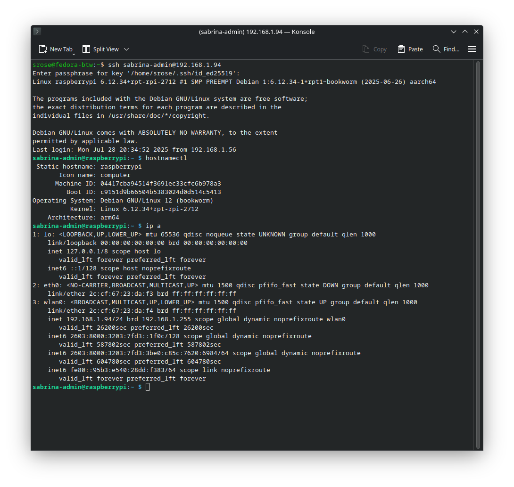

*Output of ip a on the Pi before static IP configuration. This verifies the current dynamic IP assigned to interface wlan0 and confirms network interface availability.*

---

### **Figure 2b: Configuring Static IP via NetworkManager (nmcli)**  

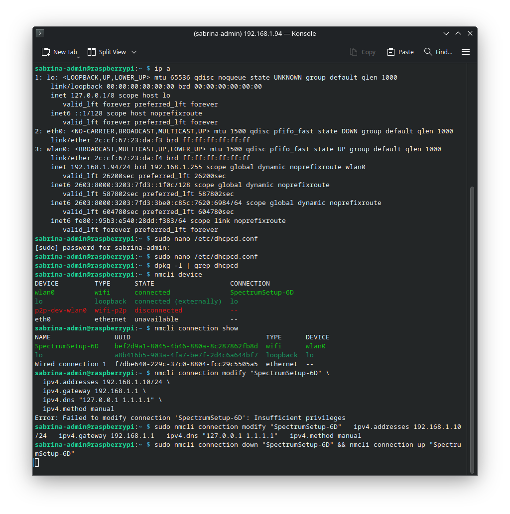

*The nmcli command used to assign a static IP (192.168.1.10) to the Pi's wlan0 interface. This replaces the older dhcpcd.conf method and is compatible with Debian Bookworm's default networking setup.*

---

### **Figure 3: Static IP Successfully Applied and Verified**  


*Post-reboot output showing the Pi has retained the static IP on wlan0. This was confirmed via terminal on the Pi after reactivating the connection using NetworkManager.*

---

### **Figure 4: Fedora SSH Session into Pi with Static IP**  

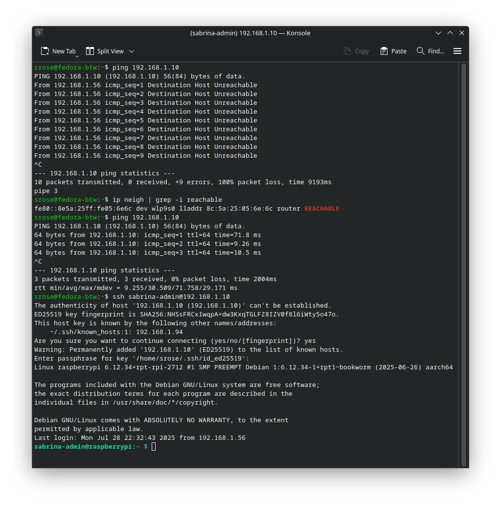

*Fedora successfully pings and SSHs into the Pi at 192.168.1.10, confirming static IP configuration and network accessibility from the client system.*

---

### **Figure 5: Pi-hole Install Completion Summary**  

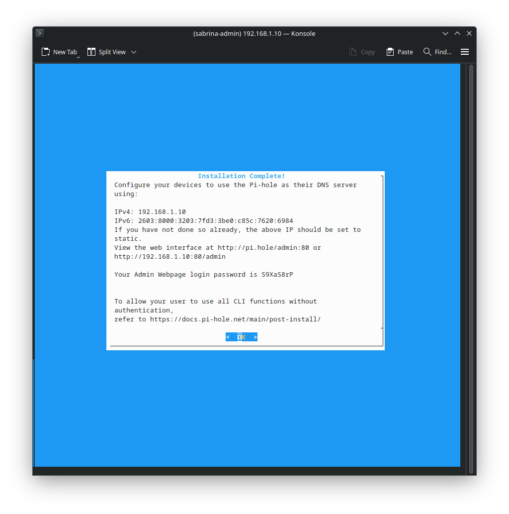

*The final screen of the Pi-hole installation wizard, showing confirmation of web admin interface location, IPv4 and IPv6 settings, and default web login password.*

---

### **Figure 6: Pi-hole Admin Dashboard (Post-Install)*  

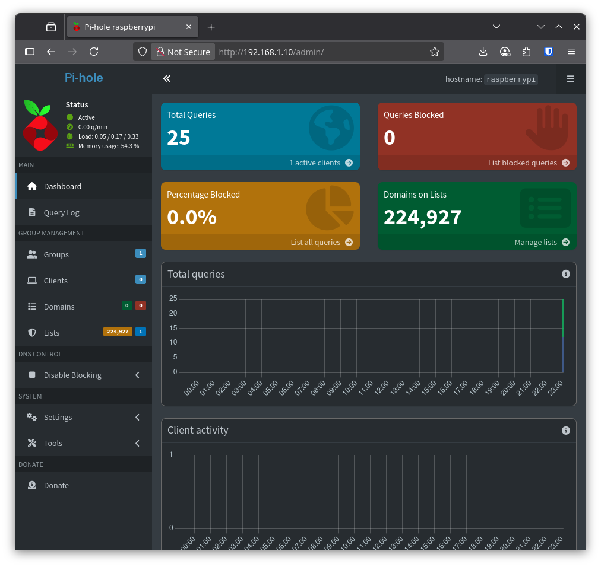

*First view of the Pi-hole web interface after login. Shows live system status, domain blocklists, and connected clients. Pi-hole is now running and operational on the Pi.*

---

### **Figure 7: Fedora DNS Resolution Through Pi-hole**  

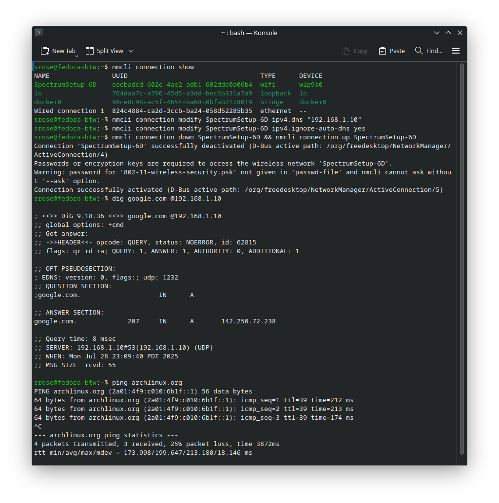

*Fedora rerouted its DNS to use the Pi-hole (192.168.1.10). Verified using dig and ping, confirming functional DNS resolution. Corresponding queries appeared instantly in the Pi-hole admin logs.*

---

### **Figure 8: Pi-hole Admin Dashboard – DNS Query Log**  

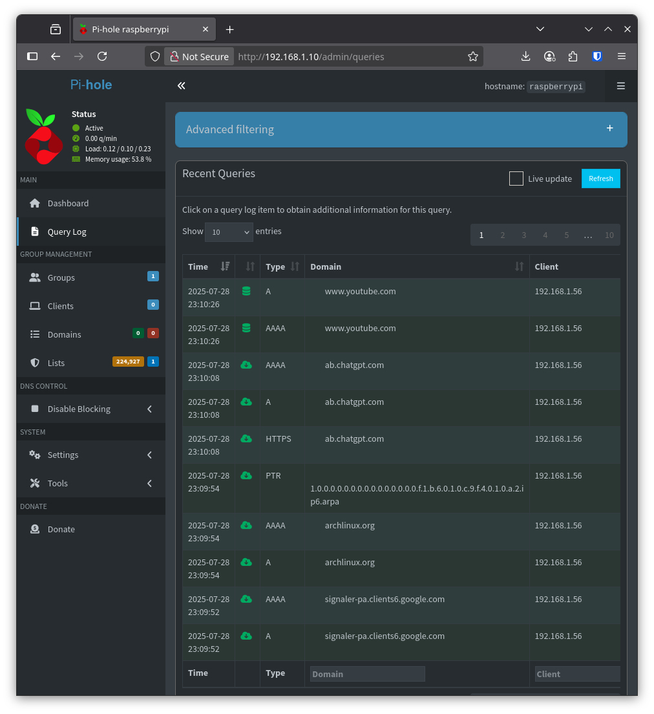

*Shows successful DNS queries from Fedora (192.168.1.56) being logged and resolved by Pi-hole (192.168.1.10). Domains such as youtube.com, chatgpt.com, and archlinux.org confirm that DNS resolution is working as expected.*

---

### **Figure 9: Fedora DNS Failover Configuration**  

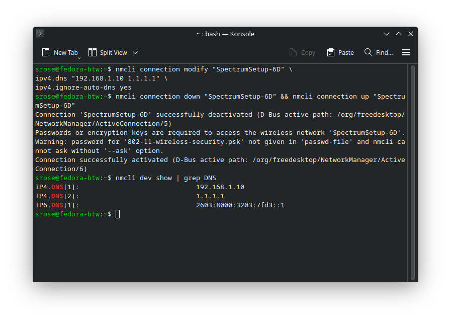

*Displays the nmcli commands used to set the primary DNS to the Pi-hole IP (192.168.1.10) and the secondary fallback DNS to Cloudflare (1.1.1.1). Output of nmcli dev show | grep DNS confirms successful application.*

---

### **Figure 10: Pi-hole FTL Configuration (REPLY_ADDR4)**  

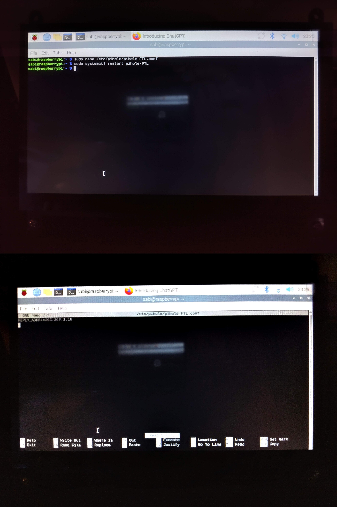

*Screenshot of the /etc/pihole/pihole-FTL.conf file on the Raspberry Pi. The configuration line REPLY_ADDR4=192.168.1.10 ensures local DNS replies are properly routed through the Pi-hole’s static IP. This supports local DNS reflection and logging.*

---

### **Figure 11: Pi-hole FTL Service Status**  

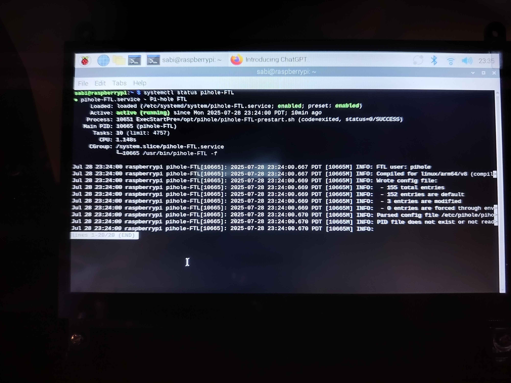

*Confirms the Pi-hole FTL service is active and running. Includes journal log lines that show the parsed configuration from pihole-FTL.conf was applied successfully. This validates correct daemon startup and configuration parsing.*

---

### **Figure 12 & 13: Pi-hole FTL Restart and Enable**  

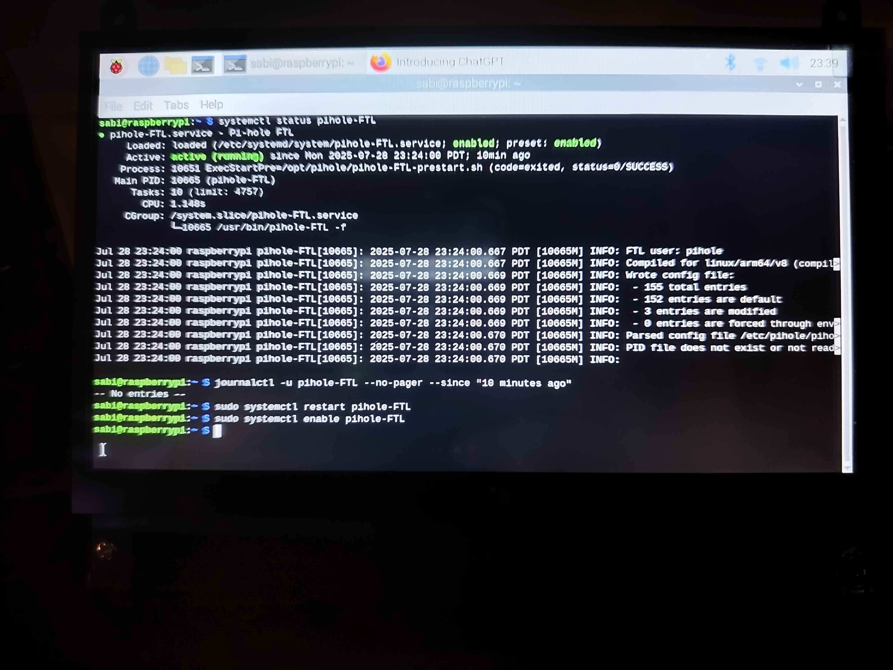

*Documents the use of systemctl to restart and enable the pihole-FTL service. Also includes a journalctl check for verifying recent logs. Confirms that the Pi-hole service will persist across reboots and is operating with current settings.*

---

## Interview/Resume Summary (STAR Format)
**S:** My goal was to create a secure, local DNS resolver using a Raspberry Pi.  
**T:** I needed to configure Pi-hole with a static IP and restrict its exposure to LAN-only queries.  
**A:** I installed Pi-hole, set a static IP using NetworkManager, configured fallback DNS on a Fedora client, and hardened the system using iptables. I verified functionality with `dig` and tested firewall behavior using `nmap`.  
**R:** I achieved a functioning DNS lab with persistent firewall rules, full DNS resolution from clients, and zero external exposure.

---

## References & Resources
- [Pi-hole Documentation](https://docs.pi-hole.net/)
- [ArchWiki - iptables](https://wiki.archlinux.org/title/Iptables)
- [Debian Networking Guide](https://wiki.debian.org/NetworkConfiguration)
- [nmcli Documentation](https://developer.gnome.org/NetworkManager/stable/nmcli.html)
- [iptables-persistent GitHub](https://github.com/netfilter/iptables-persistent)
